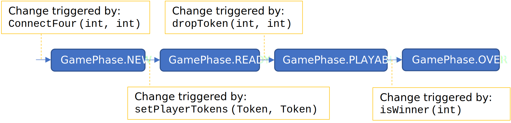

.. project information
.. |title| replace:: C4 Alpha
.. |slug| replace:: cs1302-c4-alpha
.. |ttslug| replace:: ``cs1302-c4-alpha``
.. |course| replace:: CSCI 1302
.. |semester| replace:: Fall 2022
.. |version| replace:: v2022.fa
.. |server| replace:: Odin
.. |discussion_board| replace:: Piazza

.. notices (need to manually update the urls)
.. |website| image:: https://img.shields.io/badge/cs1302uga.github.io-cs1302--c4--alpha-58becd
   :alt: cs1302uga.github.io/cs1302-c4-alpha
.. _website: https://cs1302uga.github.io/cs1302-c4-alpha/
.. |approved_notice| image:: https://img.shields.io/badge/Approved%20for-Fall%202022-green
   :alt: Approved for: |version|
.. |not_approved_notice| image:: https://img.shields.io/badge/In%20development-Not%20yet%20approved-red
   :alt: In development - Not yet approved

|course| - |title| |version|
#############################

.. #|approved_notice|

|not_approved_notice| |website|_

This document contains the description for the |title| project assigned to the students in the
|semester| |course| classes at the University of Georgia. **Students who are assigned this project
are expected to read the entirety of this project description file before beginning their project.**

----

.. contents::

----

Project Preface
===============

Motivation
++++++++++

This first |course| project for |semester| is designed to help you apply and extend your
prerequisite Java programming knowledge with new concepts from |course| in a Unix development
environment (i.e., |server|).

If you are competent with the learning outcomes for CSCI 1301 (i.e., the prerequisite course), then
you already have most of the Java programming knowledge required to complete this project;
otherwise, this assignment will help you identify the gaps in your prerequisite programming
knowledge so that you can tackle those gaps early in the semester. We also recommend completing the
`Tic-Tac-Toe Assignment <https://github.com/cs1302uga/cs1302-hw00>`_ before beginning this project.

This project will also require you to apply some of the new concepts covered in |course|, including
named packages, exception (creating and handling), and Java development in a Unix environment. If
you have actively engaged with the |course| course content offered so far this semester, then you
should be able to comfortably, but not necessarily quickly, complete those aspects of the project by
applying what you have practiced and learned from your content engagement.

Finally, this project may require you to do things that you have never been given explicit
directions or instructions for -- this is just a part of software development. In such cases, you
may need need to do some research to help you plan your solution. That being said, we have
carefully prepared this project description document so that it hopefully answers the majority of
your questions -- if not, then please do not hesitate to ask a question on the course
|discussion_board| or during office hours.

Academic Honesty
++++++++++++++++

All students at the University of Georgia explicitly agree to abide by the UGA student honor code
when they sign the application for their admission to the University. Additionally, all students
enrolled in a |course| course section in |semester| are subject to the Academic Honesty policy
included in the |semester| |course| course syllabus. Furthermore, anyone with access to this
project description document is expected to respect the copyright and licensing terms provided or
linked to at the bottom of this document.

With academic honesty in mind, we ask all |semester| |course| students not to fork this repository
on GitHub. Doing so may make your copy of the project publicly visible, and that can  violate
several of the policies described earlier. Instead of forking the repository, please follow the
instructions provided later in this document to acquire a copy of the project description and
starter code.

Course-Specific Learning Outcomes
+++++++++++++++++++++++++++++++++

.. |lo_full| replace:: ⭐⭐
.. |lo_part| replace:: ⭐

If you work on and complete this project, then you will gain exposure and practice with
the following learning outcomes:

=====  =========  ===========
#      Exposure   Description
=====  =========  ===========
LO1.a  |lo_full|  Navigate and modify files, directories, and permissions in a multi-user Unix-like environment.
LO1.b  |lo_part|  Execute, redirect, pipe, and manage programs/processes in a multi-user Unix-like environment.
LO1.c  |lo_full|  Create and modify text files and source code using a powerful terminal-based text editor such as Emacs or Vi.
LO1.d  |lo_full|  Use shell commands to compile new and existing software solutions that are organized into multi-level packages and have external dependencies.
LO2.b  |lo_full|  Define, throw, and propagate exceptions appropriately in a software solution.
LO3.a  |lo_full|  Create and update source code that adheres to established style guidelines.
LO3.b  |lo_part|  Create class, interface, method, and inline documentation that satisfies a set of requirements.
LO7.c  |lo_part|  Use common abstract data types and structures, including lists, queues, arrays, and stacks in solving typical problems.
=====  =========  ===========

Project Updates
+++++++++++++++

If your instructor updates the project's requirements or starter code before the project is due,
then this section will be updated to include a summary of those updates and, if needed,
instructions that describe how to update your working copy of the project with
the latest versions of any changed files.

Project Description
===================

.. |gameutil_api_here| replace:: here
.. _gameutil_api_here: https://cs1302uga.github.io/cs1302-c4-alpha/doc

Introduction
++++++++++++

In this project, you will implement and test a class that represents the popular board game
`Connect Four <https://en.wikipedia.org/wiki/Connect_Four>`_. Connect Four is a two-player connection game involving
a two-dimensional grid of tokens. Here are the basic rules for Connect Four:

* To prepare a new game of Connect Four, the grid is setup to accommodate an acceptable number
  of rows and columns; however, it should not yet contain any tokens.
* To get ready to play, both players are assigned a unique token.
* To play the game, both players take turns "dropping" copies of their token into non-full
  columns in the grid. When a token is dropped, it falls to the lowest position in the
  column that does not yet contain a token.
* To win the game, a player must strategically drop their tokens so that four of them connect
  inside the grid -- they are allowed to connect horizontally, vertically, and diagonally.
* The game is over once all positions in the grid a filled or when a player wins the game.

The class that you will implement and test will be expected to provide the high-level
functionality described above via its constructor and instance methods -- the specific details
about what is required are included later in this document. What you are about to read may
seem counter-intuitive, but **you will not be writing any code for this project to let users
interactively play a game of Connect Four**; instead, you will implement and test a class that,
once fully implemented, can be used to make writing such an interactive program easier.

Getting Started
+++++++++++++++

**You will not be starting from scratch.** Instead, starter code is provided that you will
need to download in order to get started, then modify and test to meet the project's
requirements. To download the starter code, follow these instructions:

1. Login to |server|.
2. If you have not done so, create a directory to store all of your |course| projects.
3. Change to your |course| projects directory.
4. Execute the following command to download the starter code into a sub-directory called |ttslug|::

   $ git clone --depth 1 https://github.com/cs1302uga/cs1302-c4-alpha.git

5. Change to the |ttslug| directory that was just created, then use the ``tree`` command to
   verify that you now have a copy of the starter code under ``src``::

     $ tree src
     src
     └── cs1302
         └── game
             ├── ConnectFour.java
             └── ConnectFourDriver.java

.. _freqs:

Functional Requirements
+++++++++++++++++++++++

A *functional requirement* defines a specific behavior between program inputs and outputs,
and a collection of functional requirements describes how a program should function. If
your submission satisfies a functional requirement listed in this section, then the
requirement's point total is added to your submission grade.

.. _connect_four_reqs:

``cs1302.game.ConnectFour``
---------------------------

The ``cs1302.game.ConnectFour`` class is one of the classes that you are responsible for
implementing and testing. When you downloaded the starter code, a partially implemented version of
this class was included under the project's ``src`` directory:

:Source: ``src/cs1302/game/ConnectFour.java``
:FQN: ``cs1302.game.ConnectFour``
:Package Name: ``cs1302.game``
:Simple Name: ``ConnectFour``

When you implement this class, you will not have much leeway in terms of the class's overall design;
however, you are free to add additional instance methods, as needed, to improve readability and
code reuse. The specific details regarding what you are explicitly not permitted to do are explained
later in the `Non-Functional Requirements <#non-functional-requirements>`_ section.

It should also be noted that the ``ConnectFour`` class depends on some classes that we have included
in ``lib/cs1302-gameutil.jar`` -- you do not have access to source code for the classes in that Java
ARchive (JAR) file; however, API documentation for those classes is provided |gameutil_api_here|_. The
compilation instructions that we include below will ensure that these dependencies are available
on the class path so that the compiler can find them.

How to Compile
**************

To compile ``ConnectFour.java``, execute the following command while directly inside the
|ttslug| directory::

   $ javac -cp lib/cs1302-gameutil.jar -d bin src/cs1302/game/ConnectFour.java

Once compiled, you can begin to test the ``ConnectFour`` class by modifying and running the
`provided driver class <#cs1302gameconnectfourdriver>`_.

Game Phases
***********

.. |GamePhase| replace:: ``cs1302.gameutil.GamePhase``
.. _GamePhase: https://cs1302uga.github.io/cs1302-c4-alpha/doc/cs1302/gameutil/GamePhase.html

Your implementation of ``cs1302.game.ConnectFour`` is expected to support the multiple phases
defined by the |GamePhase|_ enumeration. When a ``ConnectFour`` game object is constructed, its
said to be in the ``GamePhase.NEW`` phase -- that just means that ``GamePhase.NEW`` is assigned
to the object's ``phase`` instance variable. The game object may move into other phases as methods
are called on it. The behavior of some methods depend on the phase the object is in when called.
Here is a high-level overview of all the required phases and the methods that trigger a game
object to change what phase it is in:

The details for each game phase are provided below:

:``GamePhase.NEW``:

   **A newly constructed game is in this phase.**

   When a ``ConnectFour`` object is created, the constructor should check for any exceptional cases,
   then initialize the object's instance variables to the the values described below:

   :``rows``:            the supplied value of the ``rows`` constructor parameter
   :``cols``:            the supplied value of the ``cols`` constructor parameter
   :``grid``:            a two-dimensional ``Token`` array with ``rows``-many rows and ``cols``-many columns
   :``player``:          a one-dimensional ``Token`` array of length ``2``
   :``numDropped``:      the ``int`` value ``0``
   :``lastDroppedRow``:  the ``int`` value ``-1``
   :``lastDroppedCol``:  the ``int`` value ``-1``
   :``phase``:           ``GamePhase.NEW``

   Below is an example of some code that constructs a game object with six rows and seven columns followed
   by an illustration of what the inside of that object should look like when its done being constructed:

   .. code-block:: java

      ConnectFour game = new ConnectFour(6, 7);

   .. image:: img/GamePhase.NEW.svg
      :width: 100%

:``GamePhase.READY``:
   **A game that is ready to be played is in this phase.**

   A game object that is in the ``GamePhase.NEW`` phase should move into the ``GamePhase.READY``
   phase when its ``setPlayerTokens`` method is called for the first time.

   Below is an example of some code that sets the player tokens of a game object in the
   ``GamePhase.NEW`` phase followed by an illustration of what the inside of that object
   should look like immediately after the code has executed and the object is in the
   ``GamePhase.READY`` phase:

   .. code-block:: java

      game.setPlayerTokens(Token.RED, Token.BLUE);

   .. image:: img/GamePhase.READY.svg
      :width: 100%

:``GamePhase.PLAYABLE``:
   **A game that is being played is in this phase.**

   A game object that is in the ``GamePhase.READY`` phase should move into the ``GamePhase.PLAYABLE``
   phase when its ``dropToken`` method is called for the first time.

   Below in example of some code that drops several tokens into the grid of a game object
   in the ``GamePhase.READY`` phase. Each line of code is followed by an illustration of what
   the inside of that object should look like immediately after the line has executed
   -- please note that the object is in ``GamePhase.PLAYABLE`` phase immediately after
   the first line has executed:

   .. code-block:: java

      game.dropToken(0, 0); // first player, column 0

   .. image:: img/GamePhase.PLAYABLE.1.svg
      :width: 100%

   .. code-block:: java

      game.dropToken(1, 1); // second player, column 1

   .. image:: img/GamePhase.PLAYABLE.2.svg
      :width: 100%

   .. code-block:: java

      game.dropToken(0, 1); // first player, column 1

   .. image:: img/GamePhase.PLAYABLE.3.svg
      :width: 100%

   .. code-block:: java

      game.dropToken(1, 2); // second player, column 2

   .. image:: img/GamePhase.PLAYABLE.4.svg
      :width: 100%

:``GamePhase.OVER``:
   **A game that has ended is in this phase.**

   A game object that is in the ``GamePhase.PLAYABLE`` phase should move into the ``GamePhase.OVER``
   phase when its ``isWinner`` method is called and one of the following conditions are met:

   * the grid full; or
   * the method is about to return ``true`` because a player has won.

   Consider the following illustration of a game object that is currently in the
   ``GamePhase.PLAYABLE`` phase:

   .. image:: img/GamePhase.OVER.PRE.svg
      :width: 100%

   Below is an example of some code that drops a winning token into the grid of the game object
   depicted above, then checks for that win using the object's ``isWinner`` method. The code is
   followed by an illustration of what the inside of that object should look like immediately after
   the code has executed -- please note that the object moves into the ``GamePhase.OVER`` phase
   immediately after the call to ``isWinner(1)`` has executed:

   .. code-block:: java

      game.dropToken(1, 4); // second player, column 4

      if (game.isWinner(0)) {
          System.out.println("first player has won!");
      } else if (game.isWinner(1)) {
          System.out.println("second player has won!"); // this one!
      } // if

   .. image:: img/GamePhase.OVER.POST.svg
      :width: 100%

Specific Requirements
*********************

:``ConnectFour(int, int)`` (10):
   The ``ConnectFour`` constructor is expected to behave in accordance with the API documentation
   included in the starter code and the expectations described in the `Game Phases <#game-phases>`_
   section presented earlier in this document.

   :``getRows()`` (2):
      TODO

   :``getCols()`` (2):
      TODO

cs1302.game.ConnectFourDriver
-----------------------------

The ``cs1302.game.ConnectFourDriver`` class is where you will write code to test your
``cs1302.game.ConnectFour`` class. When you downloaded the starter code, a partially
implemented version of this class was included under the project's ``src`` directory:

:Source: ``src/cs1302/game/ConnectFourDriver.java``
:FQN: ``cs1302.game.ConnectFourDriver``
:Package Name: ``cs1302.game``
:Simple Name: ``ConnectFourDriver``

You should use this driver class to help you test the constructor and methods of
your ``ConnectFour`` class under different scenarios. In many respects, you have a lot
of lee way The specific details regarding what you are explicitly not permitted to do are explained
later in the `Non-Functional Requirements <#non-functional-requirements>`_ section.

It should also be noted that the ``ConnectFourDriver`` class depends on some classes that we have included
in ``lib/cs1302-gameutil.jar`` -- you do not have access to source code for the classes in that Java
ARchive (JAR) file; however, API documentation for those classes is provided |gameutil_api_here|_. The
compilation instructions that we include below will ensure that these dependencies are available
on the class path so that the compiler can find them.

How to Compile and Run
**********************

To compile ``ConnectFourDriver.java``, you need to first (re)compile ``ConnectFour.java``, then
run the following command directly inside the |ttslug| directory::

   $ javac -cp bin:lib/cs1302-gameutil.jar -d bin src/cs1302/game/ConnectFourDriver.java

Once compiled, you can run ``cs1302.game.ConnectFourDriver`` using ``java``::

  $ java -cp bin:lib/cs1302-gameutil.jar cs1302.game.ConnectFourDriver

Specific Requirements
*********************

There are functional requirements for ``cs1302.game.ConnectFourDriver``. Just keep in mind that
you are expected to use it to help you test your code.

.. _nfreqs:

Non-Functional Requirements
+++++++++++++++++++++++++++

A *non-functional requirement* specifies criteria that can be used to judge your submission
independently from its function or behavior. If functional requirements describe what your
submission should *do*, then the non-functional requirements describe how your submission is
supposed to *be*. If your submission does not satisfy a non-functional requirement listed in
this section, then the requirement's point total is deducted from your submission grade.

:Structure (10/100):
   TODO.

:Environment (100):
   This project must be implemented in Java 17, and it must compile and run correctly on
   Odin using the specific version of Java 17 that is setup according to the instructions
   provided by your instructor. Graders are instructed not to modify source code when they
   attempt to compile a submission.

:Code Style (20):
   Every ``.java`` file that you include as part of your submission for this project must
   be in valid style as defined in the `CS1302 Code Style Guide <styleguide>`_. All of the
   individual code style guidelines listed in that document are part of this single
   non-functional requirement. This requirement is all or nothing.

   .. _styleguide: https://github.com/cs1302uga/cs1302-styleguide

Submission Instructions
+++++++++++++++++++++++

You will submit your project on |server|. Before you submit, make sure that your project files are
located in a directory called |ttslug| -- if you followed the instructions provided earlier in this
document to download the project, then that is your directory name. To submit, change into the
parent of your project directory (i.e., one directory above it), then complete the steps below:

1. Check your code style -- we know that you have done this frequently, but it does not hurt to
   double check it before you submit::

     $ check1302 cs1302-c4-alpha

   If there are style violations, then fix them and retest your code!

2. Once you have no style guide violations and your code compiles and works, you can submit your
   work using the following command::

     $ submit cs1302-c4-alpha csci-1302

3. Inspect the output of the last command to verify that your project was submitted. Your
   |ttslug| directory should now contain a ``rec`` (receipt) file.

If you have any problems submitting your project then please contact your instructor as soon as
possible; however, doing this the day or night the project is due is probably not the best idea.

Project Checklist
=================

To help you with planning out this project, here are some suggested steps you can take that your
instructors believe will help you complete the project more easily. Some of the items in this
checklist may not make sense until you have read the entire project description. These steps are
suggestions and, therefore, do not constitute an exhaustive list of the steps that you may need to
take to complete the project.

Preparation
+++++++++++

:Target: Finish before Monday, Jan. 31st.

1. Start reading the project description.

2. Read through the entire project description, including any `appendices <#appendices>`_,
   **and write down questions as you go**.

3. Read it again! This time, you may be able to answer some of your own questions.

Planning
++++++++

:Target: Finish before Tuesday, Feb. 1st.

1. If you have not yet done so, `download the starter code <#getting-started>`_ on |server|.

2. Read all of the comments included in ``src/cs1302/game/ConnectFour.java``, but
   **do not write any code yet!** Instead, try to list out the high-level steps for
   the constructor and methods using bullet points.

3. Read through the notes you just wrote. If you see that the steps you wrote for one method
   include a sequence of steps in another method, then consider whether you can have one
   method can call the other -- that's code reuse! If you see the exact same steps in several
   methods, then consider factoring out the common parts into a single method that you can
   call in several places -- that's code reuse and refactoring!

4. Read all of the comments included in ``src/cs1302/game/ConnectFourDriver.java``, then
   modify the ``main`` method so that it calls ``testConstructor()``. After that, compile
   ``ConnectFourDriver.java``, but do not run it. You are now prepared to test some
   aspects of the ``ConnectFour(int, int)`` constructor once you begin to implement it.

Implementing
++++++++++++

:Target: Finish before Monday, Feb. 7th

1. Implement the ``ConnectFour(int, int)`` constructor, ensure it's written with good code style,
   then test it by running the ``cs1302.game.ConnectFourDriver`` class.

   * You should add additional methods to ``ConnectFourDriver.java`` to test your constructor
     implementation under different scenarios -- be sure to call those methods in
     ``testConstructor()`` so that they get executed along with the other tests. Repeat this as
     needed.

   * There are some aspects of the constructor that you should test later. For example, you
     can test that ``rows`` is assigned correctly when you implement and test your ``getRows()``
     method.

2. Implement the ``getRows()`` method, ensure it's written with good code style, then test it
   by adding test methods to the ``cs1302.game.ConnectFourDriver`` class in a manner that is
   consistent with your constructor tests.

   * When you add and call your test method(s) for ``getRows()``, you should NOT
     comment out existing tests. You should always run all tests that you have each time you
     run ``cs1302.game.ConnectFourDriver`` just in case a recent change breaks something that
     you previously thought was working.

3. Implement the ``getCols()`` method, ensure that it's written with good code style, then test
   it by adding test methods to the ``cs1302.game.ConnectFourDriver`` class in a manner that is
   consistent with your existing tests.

4. Repeat this process to implement, style check, and test the remaining methods in the order
   that they appear in the starter code.

Review
++++++

:Target: Finish before Wednesday, Feb. 9th.

1. Do one final pass through the project document to make sure that you didn't miss anything.
2. Run your code through your test cases one last time.
3. Check your code style one last time.
4. Submit your code on Odin.

Appendices
==========

.. #############################################################################

.. copyright and license information
.. |copy| unicode:: U+000A9 .. COPYRIGHT SIGN
.. |copyright| replace:: Copyright |copy| Michael E. Cotterell, Bradley J. Barnes, and the University of Georgia.
.. standard footer
.. footer:: |copyright| See `LICENSE.rst <LICENSE.rst>`_ for license information.
            The content and opinions expressed on this Web page do not necessarily
            reflect the views of nor are they endorsed by the University of Georgia or the University
            System of Georgia.
